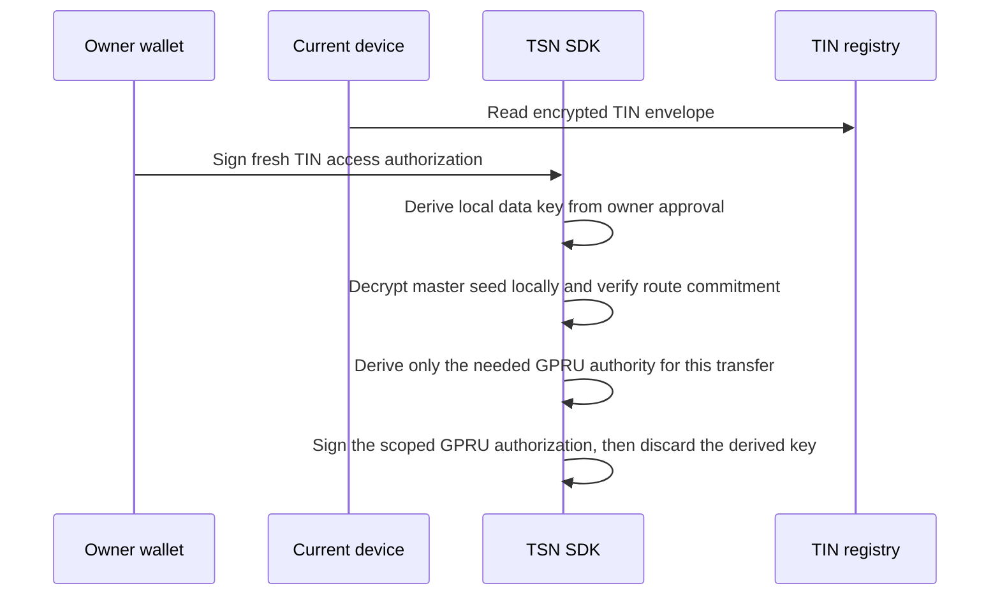

TSN separates _who the payment is for_ from _what accounts move on Solana_. Identity is a Transfer Identity Number (TIN) issued and resolved by the Transfer Identity Protocol (TIP); routing and authorization scope travel with the transfer through GPRU. Neither TIN nor GPRU takes custody of funds or keys.

## TIN: Transfer Identity Number

A **Transfer Identity Number (TIN)** is a portable, 10-digit payment identity issued and resolved by the **Transfer Identity Protocol (TIP)**. A sender uses the recipient's TIN to discover an authorized payment route, without asking the recipient to share a wallet address.

<Info>
  A TIN is a payment identity, not a wallet or private key. It resolves to permitted routing metadata; it never owns a token account by itself.
</Info>

### TIN vs. a wallet address

| Wallet address | TIN |
| --- | --- |
| Public cryptographic account identifier | TSN payment identity and route-discovery identifier |
| Identifies a public key or account authority | Resolves permitted payment routing metadata |
| May own token accounts | Does not itself hold tokens or act as a private key |
| Usually exposes the address directly | Binds to the TCAP relationship and encrypted snapshot path |

A TIN does not replace every Solana address. The final settlement transaction still uses public keys, token accounts, PDAs, and program accounts as required by Solana.

### What a TIN record can contain

The root wallet (or an implemented root signer) owns and authorizes the TIN. A TIN record may hold four classes of data, each on a different boundary:

| Class | Examples | Boundary |
| --- | --- | --- |
| Public | TIN number, display label, active status, route version | Returnable for resolution, subject to anti-enumeration controls |
| Integrity metadata | Owner-key commitment, route commitment, state version | Public verification material, not private authority |
| Encrypted | Privacy-receiving-root metadata, private snapshot references, recovery material | Ciphertext; unlock requires fresh approval from the owning wallet |
| Off-chain application data | Optional profile or notification references | Stored by the application under its own access policy |

The exact on-chain layout is implementation-specific. Do not infer private plaintext from a public account or registry response.

### Resolution flow

<Steps>
  <Step title="Sender enters the 10-digit TIN">
    A sender supplies the recipient's TIN to a TSN-integrated interface such as TrustLink Pay.
  </Step>
  <Step title="TIP resolves public routing metadata">
    The TIN service or on-chain registry returns the active public routing metadata for that TIN, subject to non-enumeration and rate limits.
  </Step>
  <Step title="TSN SDK binds the relationship">
    The TSN SDK resolves the GPRU/TCAP relationship commitment and policy that the sender will bind into the signed intent.
  </Step>
  <Step title="Route is bound to the signed intent">
    The recipient route commitment and route version are included in the sender-signed plan. Any later change to the route invalidates the signature.
  </Step>
  <Step title="Owner approves locally when needed">
    When local private derivation is required, the owning wallet gives a fresh approval on the current device. A TIN is not tied to one browser or one device.
  </Step>
</Steps>

Resolution must not return plaintext seeds, child private keys, or an unrestricted wallet-to-person mapping. Implementations must apply non-enumeration, rate limiting, revocation, and state-version checks.

### Wallet-owned access

The root wallet is the TIN authority. New and upgraded TINs use a wallet-owned envelope: the owner signs a fresh, canonical TIN-access authorization on whichever device they are using, and the SDK derives a local data key from that approval to decrypt the envelope on-device.

Plaintext seeds and derived child private keys never leave the device. They are never sent to a Receiver, Node, Cranker, or application backend. Older device-bound envelopes remain readable only by a device that can already unlock them, until the owner performs a one-time upgrade.

<Warning>
  A TIN is not a username, a bank-account number, or a legal identity on its own. Any legal-name, business, phone, or verification context is optional enrichment and must not be confused with payment authorization.
</Warning>

### Encrypted master seed and GPRU authorization

Each TIN carries an **encrypted master seed** stored inside the TIN registry as ciphertext. It is random local root material that never appears in plaintext on-chain and never leaves the owner device once decrypted. It is not a replacement wallet, and it does not turn the Receiver, Node, or Cranker into a custodian of the TIN.

This seed is the private root from which the SDK derives **GPRU scope authorities** for a specific transfer. Without a fresh owner-wallet approval that unlocks the seed on the current device, no GPRU authorization signature can be produced. This is what binds GPRU authorization to the TIN owner rather than to whichever operator holds the TIN's public state.

| Item | Storage | Boundary |
| --- | --- | --- |
| Owner-wallet binding | TIN registry, public | Public integrity metadata |
| Encrypted master-seed envelope | TIN registry, ciphertext | Sealed to the owner wallet under `wallet-owner-signature-v1` |
| Route commitment and route version | TIN registry, public | Bound into the signed intent |
| Owner-key commitment | TIN registry, public | Verifies the wallet that can unlock the envelope |
| Plaintext master seed | Owner device only, transiently | Never sent to Receiver, Node, Cranker, or backend |
| Derived GPRU authority | Owner device only, per transfer | Signs the scoped authorization, then discarded |

The flow the SDK uses on the current device is:

Two properties make this safe under a compromised operator:

- The registry only holds ciphertext. Reading the TIN registry account gives an attacker the envelope but not the seed; the envelope is sealed to the owner wallet.
- The GPRU authority derived from the seed is transfer-scoped. Even if a derived signing key were captured on a compromised device, the resulting signature is bound to that transfer's commitments and cannot be lifted onto a different intent.

<Note>
  Older `tsn-device-envelope-v1` records were device-bound. They remain readable only by a device that can already unlock them, until the owner performs a one-time upgrade to the wallet-owned envelope. New and upgraded TINs use the wallet-owned model above.
</Note>

## GPRU: authorization and routing scope

**GPRU** carries the authorization and routing scope of a transfer. It is deliberately non-custodial: it never holds funds, balances, or custody keys. GPRU is derived from a TIN privacy-receiving root, a settlement commitment, epoch context, and authorization scope, using separate domain tags for identity derivation and authorization signing.

The chain sees only fixed-length commitments and derived PDAs. TIN encrypted metadata stays encrypted off-chain; the public account state carries only its hash.

What GPRU does:

- Scopes what a transfer is permitted to do (destination binding, amount context, epoch, policy).
- Binds the authorization message so that a valid signature cannot be lifted onto a different transfer.
- Provides the `gpru_scope_commitment` that TSN and TCAP check together against the receipt.

What GPRU does not do:

- Hold or transfer funds.
- Own a token account.
- Grant permission to construct an arbitrary transaction from a resolved route.

## TCAP relationship

A TIN binds to a TCAP relationship through an opaque commitment, a relationship reference, and a policy commitment. The on-chain registry never receives policy plaintext, a static PRU list, pre-generated receiving wallets, or a maximum-PRU field. See [TCAP](/architecture/tcap) for how the tip PDA and encrypted snapshots use these commitments.

## What is public vs. private

| Public on-chain | Private / off-chain |
| --- | --- |
| TIN number and display metadata (resolution subject to controls) | Plaintext seeds and child private keys |
| Route commitment and route version | Plaintext route map and recipient wallet map |
| Owner-key commitment, state version | Snapshot decryption keys |
| GPRU scope commitment carried in receipts | Privacy-receiving root and derivation material |
| TCAP relationship and policy commitments | Encrypted TIN envelope contents |

## Historical note: ZK-PRU is retired

Earlier revisions of TIN used a ZK-PRU public-route model with funded PRU receiving units. That model is retired. New TCAP/GPRU accounts reject legacy PRU configuration and route-envelope data. See [Current Technology](/about/current-technology) for the live scope and [Architecture Overview](/overview/architecture) for the layer map.

## Related pages

<CardGroup cols={2}>
  <Card title="Mother Authority" icon="shield-halved" href="/architecture/mother-authority">
    How Mother authorizes intent acceptance and settlement DNA above the identity layer.
  </Card>

  <Card title="TCAP" icon="lock" href="/architecture/tcap">
    How TIN-derived commitments become tip PDAs and owner-encrypted snapshots.
  </Card>

  <Card title="Payment Intent Lifecycle" icon="signature" href="/developers/payment-intent-lifecycle">
    Where the resolved TIN route and GPRU scope enter the signed intent.
  </Card>

  <Card title="Architecture Overview" icon="cubes" href="/overview/architecture">
    Identity and routing in the context of the five TSN layers.
  </Card>
</CardGroup>