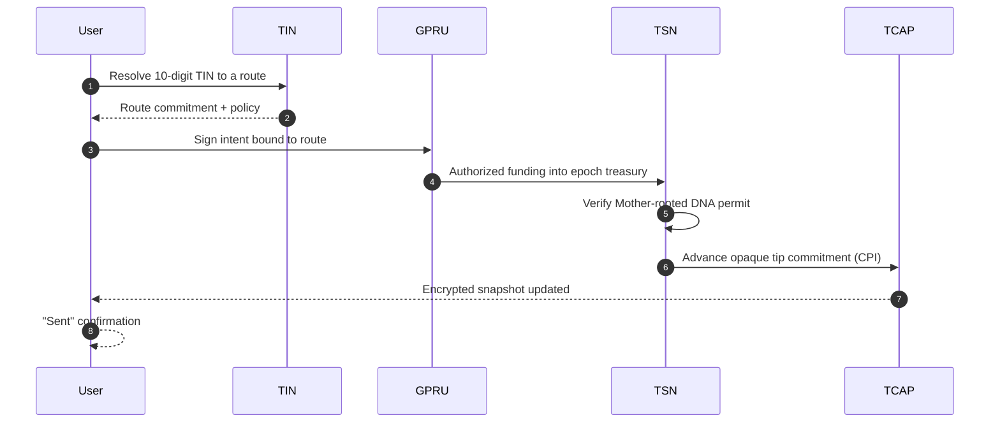

**In plain English:** From the user's side, a TSN payment is one action. Enter a 10-digit TIN, confirm, done. That single tap silently activates four cooperating layers (TIN, GPRU, TSN, TCAP) and resolves in under a second. This page explains what the user sees, and what the protocol actually did.

## What the user sees

```text
1. Type a 10-digit TIN
2. Confirm amount
3. See "Sent"
```

That is the whole product surface. No wallet address to copy. No bridge to pick. No settlement network to choose.

## What actually happens in that second



Four layers, one tap. Each layer stays inside its boundary, so the whole thing resolves without any layer having to know more than it should.

## Layer-by-layer, in one line each

| Step | Layer | What it does | What it never sees |
| --- | --- | --- | --- |
| Look up | **TIN** | Resolves the 10-digit number to a route | Sender's balance |
| Authorize | **GPRU** | Signs a scoped authorization | Custody of funds |
| Move value | **TSN** | Runs the opaque-slot settlement and cranker vault reimbursement | Recipient's TIN inside the tip transition |
| Update balance | **TCAP** | Advances the commitment tip and encrypted snapshot | Plaintext balance |

Any single layer, on its own, is useless. Together, they are a payment.

## Why the user does not see any of this

The four boundaries are the whole point. Because no layer needs the full picture, the user never has to hand it out. There is no shared payment ID, no per-transfer PDA on the privacy-safe path, no wallet address exchanged, no bridge selected.

The product is a payment. The architecture is a privacy contract.

## Related

<CardGroup cols={2}>
  <Card title="Architecture" icon="diagram-project" href="/architecture">
    The full end-to-end sequence diagram.
  </Card>

  <Card title="FAQ" icon="circle-question" href="/faq">
    What is on-chain, what is not, and what the operator can see.
  </Card>
</CardGroup>
