TSN moves a transfer through six boundaries: the authorized sender device, the Receiver, the Node/verifier, the Cranker, the Solana programs, and the owner-private snapshot store. Each boundary sees only the fields it needs. This page walks the full path and shows where the link between sender identity, recipient identity, and on-chain accounts is broken so a compromised operator cannot reconstruct it.

## Current credit path

The active identity-first, intent-based, privacy-preserving credit path is:

```text
TIN identity
  -> privacy-receiving root
  -> GPRU authorization and routing (non-custodial)
  -> TSN Epoch Treasury coordination
  -> Mother / TSN ConfidentialSettlement authorization
  -> TCAP tip credit
  -> encrypted private balance snapshot
  -> owner-device private balance read
```

## Full lifecycle diagram

The following diagram shows the complete protocol path from a sender choosing a recipient TIN through TCAP crediting the recipient tip and the owner reading their new snapshot locally. Numbers correspond to the ordered steps below.

```mermaid
flowchart TD
    A["1. Sender chooses recipient TIN, asset, amount and policy"]
    subgraph DEVICE["Authorized sender device"]
        B["2. TSN SDK resolves the TIN and privacy-receiving-root relationship"]
        C["3. SDK builds the signed payment intent, route commitment, nonce and expiry"]
        D["4. Owner signs locally; private roots, GPRU scope and snapshot key remain on device"]
    end
    F["5. Frontend submits the signed intent to the TSN Receiver"]
    subgraph RECEIVER["TSN Receiver: durable ingress, leases and evidence"]
        G["6. Payment intent stored as RECEIVED"]
        H["7. Verified payment and settlement work published"]
        O["18. Funding confirmed; settlement work becomes available"]
        R["28. Confirmed signatures, transaction evidence and receipt state stored"]
    end
    subgraph VERIFIER["TSN Node and verifier services: decision authority"]
        I["8. Node leases and verifies the payment intent"]
        J["9. Node resolves the redacted recipient binding and destination constraints"]
        P["10. Node verifies signatures, source, amount, token, policy, expiry, commitment and replay"]
        Q["11. Node prepares the exact authorized funding + acceptance work"]
        P2["12. Node confirms the work is valid and leaseable"]
    end
    subgraph ATOMIC["One atomic Solana transaction: one payer and one fee"]
        K["13. Cranker leases the verified payment intent"]
        L["14. Cranker submits one transaction with two instructions"]
        L2["tsn_fund_epoch_treasury then tsn_accept_intent"]
        L3["Same payer, amount, token, intent commitment and epoch; failure of either reverts both"]
    end
    subgraph SOLANA["Solana: TSN, Epoch Treasury and TCAP programs"]
        AA["15. Mother/TSN authorization and account checks pass"]
        M["16. TSN verifies the funding transaction and controlled accounts"]
        N["17. Epoch Treasury records the funded liability"]
        U["19. AcceptedIntentV1 stores the canonical accepted_intent_root"]
        V["22. TSN verifies the active settlement lease and one-time bindings"]
        W["23. TSN CPI registers the complete ConfidentialSettlement receipt"]
        X["24. TCAP validates policy, sequence, scope, commitments and nullifier"]
        X2["25. credit_tcap_tin_tip_v1 advances the tip and consumes replay state"]
    end
    subgraph SETTLEMENT["Later settlement and credit work"]
        S["20. Cranker leases the active settlement work"]
        T["21. Cranker submits the exact one-time settlement transaction"]
        T2["Cranker cannot change amount, token, recipient, commitments, sequence, policy or nullifier"]
    end
    subgraph PRIVATE["Owner-private balance state"]
        Y["26. Owner encrypts and persists the new balance snapshot"]
        Z["27. Owner reads and decrypts the matching snapshot locally"]
    end
    A --> B --> C --> D --> F --> G --> I --> J --> P
    P -->|"valid"| Q --> P2 --> AA --> H --> K --> L --> L2 --> L3 --> M --> N --> U --> O --> S --> T --> V --> W --> X --> X2 --> Y --> Z --> R
    P -->|"invalid or expired"| REJECT["Reject, requeue or refund according to TSN policy"] --> R
    T --> T2 --> R
```



## Boundary walkthrough

<Steps>
  <Step title="Authorized sender device (steps 1 to 4)">
    The sender chooses a recipient TIN, asset, amount, and policy. The TSN SDK resolves the TIN and the privacy-receiving-root relationship, then builds a canonical payment intent binding amount, mint, fee limits, expiry, one-time nonce, sender authorization, transaction/commitment evidence, recipient route commitment, and route version. The owner signs locally. The privacy-receiving root, GPRU authorization material, and TCAP snapshot key never leave the device.
  </Step>
  <Step title="TSN Receiver (steps 5 to 7)">
    The frontend submits the signed intent to the Receiver, which stores it as `RECEIVED`. The Receiver is durable ingress and evidence storage. It never verifies signatures, never chooses a recipient, never signs a Solana transaction, and never receives plaintext roots or snapshot keys. Once verification succeeds, the Receiver publishes the verified funding \+ acceptance work.
  </Step>
  <Step title="TSN Node and verifier services (steps 8 to 12)">
    The Node leases the intent, resolves the redacted recipient binding, and verifies signatures, source, amount, token, policy, expiry, commitment, and replay material. If everything checks out, the Node prepares the exact authorized funding \+ acceptance work and confirms it is leaseable. The Node does not create an AcceptedIntent off-chain; that account is materialized on Solana by the TSN program.
  </Step>
  <Step title="Atomic funding + acceptance (steps 13 to 17)">
    A Cranker leases the verified intent and submits one atomic Solana transaction with two instructions: `tsn_fund_epoch_treasury` runs first, then `tsn_accept_intent`. The same payer, amount, token, intent commitment, and epoch are bound to both. If either instruction fails, the whole transaction reverts, so partial funding without acceptance is impossible and no second fee is paid.

    On chain, Mother/TSN authorization and account checks pass, TSN verifies the funding transaction and the controlled accounts, and the Epoch Treasury records the funded liability as aggregate accounting, not a per-user balance.
  </Step>
  <Step title="AcceptedIntent and published settlement work (steps 18 and 19)">
    The `AcceptedIntentV1` PDA stores the canonical `accepted_intent_root` derived over the bound fields. The Receiver marks funding as confirmed and publishes the settlement work.
  </Step>
  <Step title="Settlement submission (steps 20 to 22)">
    A Cranker leases the settlement work and submits the exact one-time settlement transaction. The Cranker cannot change amount, token, recipient binding, commitments, sequence, policy, GPRU scope, nullifier, or expiry; the Solana program re-checks the active lease and one-time bindings before any state changes.
  </Step>
  <Step title="ConfidentialSettlement and TCAP credit (steps 23 to 25)">
    The TSN CPI wrapper registers the complete `ConfidentialSettlement` receipt. TCAP validates the receipt against the tip PDA: policy commitment, sequence, GPRU scope, previous/new commitments, and nullifier. `credit_tcap_tin_tip_v1` advances the tip from `previous_commitment` to `new_commitment` and atomically consumes the replay state. A malformed, mismatched, wrong-transition, or replayed receipt is rejected.
  </Step>
  <Step title="Owner-private snapshot (steps 26 to 28)">
    The owner-authorized service persists a new AES-GCM `EncryptedTCapBalanceSnapshotV1` keyed by `new_commitment`. The owner device fetches the tip commitment, locates the matching ciphertext, decrypts locally, and verifies `tip.current_commitment == snapshot.new_commitment` and `tip.sequence == snapshot.sequence`. The Receiver records confirmed signatures, transaction evidence, and receipt state.
  </Step>
</Steps>

## Where the link is broken

TSN breaks the sender-to-recipient-to-account link at four different points, so a single compromised operator cannot reconstruct a full transfer:

| Where | What is broken | How |
| --- | --- | --- |
| Sender device | Between private material and the network | The privacy-receiving root, TIN envelope plaintext, GPRU derivation material, and snapshot key never leave the device |
| Receiver | Between intent metadata and recipient identity | The Receiver stores redacted work; the recipient TIN is not part of the durable verified record |
| Node | Between recipient identity and on-chain accounts | The recipient route reference is short-lived, keyed by work ID, held only inside the Node, and expires |
| Solana chain | Between plaintext balances and on-chain state | Only commitments, nullifiers, and derived PDAs are stored; balance values live only in owner-decrypted snapshots |

A Cranker submitting the final transaction cannot map the on-chain settlement back to a specific sender-recipient pair, because the accounts it uses are derived from opaque commitments and one-time slots rather than user identifiers.

## Atomic funding rationale

Funding and acceptance are one transaction on purpose. A separate funding-then-acceptance path would allow a Cranker or observer to see an unbound funding transaction, delay acceptance, or attempt to bind the funded amount to a different intent. Bundling both instructions with the same payer, amount, token, intent commitment, and epoch, and reverting on any failure, prevents this and also removes a second Solana fee.

## Terms and boundaries

- **TSN**: Transfer Settlement Network. Coordinates authorization, leases, epoch liability, and settlement execution.
- **TIN**: Transfer Identity Number. A 10-digit identity and route-discovery handle. Not a private key, token account, or balance.
- **TIP**: Transfer Identity Protocol. Issues and resolves TIN relationships.
- **GPRU**: Non-custodial authorization and routing layer. Never holds funds or balances.
- **TCAP**: Transfer Confidential Asset Protocol. Private balance accounting for tip transitions and owner-encrypted snapshots.
- **Receiver**: Durable ingress, redacted work storage, leases, status evidence. Does not receive plaintext roots or spend keys.
- **TSN Node**: Off-chain verifier. Checks signatures, policy, commitments, sequence, expiry, replay, and account bindings.
- **Mother and Epoch Treasury**: Protocol-controlled authorization and aggregate liability boundaries for an epoch.
- **Cranker**: Fee-paying submitter of already authorized work. Cannot change any bound field.
- **TCAP program**: On-chain receipt, tip, commitment, and nullifier enforcement.

Solana validators provide execution, ordering, consensus, and finality. TSN uses Solana; it does not replace Solana consensus, and TSN Nodes are not validators.

## AcceptedIntentV1 and ConfidentialSettlement receipt

For a TCAP credit, TSN creates an `AcceptedIntentV1` PDA and derives a domain-separated root over the canonical field sequence: epoch ID, intent commitment, amount, token ID, recipient tip-root commitment, settlement commitment, asset commitment, policy commitment, GPRU scope commitment, replay nonce, nullifier, and validity window. The TSN CPI wrapper reads that PDA, verifies each bound field, and consumes the intent only after the TCAP CPI succeeds.

The shared `ConfidentialSettlement` receipt includes:

```text
epoch_id, intent_commitment, amount, settlement_commitment,
accepted_intent_root, previous_tcap_root, transition_type,
asset_commitment, authorization_digest, verifier_domain_version,
valid_after_slot, expires_at_slot, replay_nonce,
tin_tip, previous_commitment, new_commitment, sequence,
token_id, policy_commitment, gpru_scope_commitment, nullifier
```

TCAP rejects an incomplete, mismatched, wrong-transition, or replayed receipt.

## Route boundaries

- **TIN-to-TIN credit**: current privacy-preserving receiving route through GPRU, TSN authorization, and TCAP tip credit.
- **Wallet-to-TIN credit**: a public source can use the same private receiving and credit boundary when the governed asset path is ready.
- **Wallet-to-wallet compatibility**: public settlement remains a separate compatibility route with public chain visibility.
- **Debit and exit**: interfaces may exist, but live confidential debit and exit remain proof-gated and disabled. A GPRU signature, hash-only payload, or placeholder proof cannot spend or drain liquidity.

## Related pages

<CardGroup cols={2}>
  <Card title="Architecture Overview" icon="cubes" href="/overview/architecture">
    The five layers that carry an intent from identity to on-chain settlement.
  </Card>

  <Card title="Separation of Concerns" icon="split" href="/overview/separation-of-concerns">
    Which role sees what, at each boundary.
  </Card>

  <Card title="Payment Intent Lifecycle" icon="signature" href="/developers/payment-intent-lifecycle">
    Field-level walk through the intent, verification, and lease states.
  </Card>

  <Card title="Confidential Settlement" icon="lock" href="/developers/confidential-settlement">
    The full ConfidentialSettlement ABI and TCAP CPI wrapper checks.
  </Card>
</CardGroup>